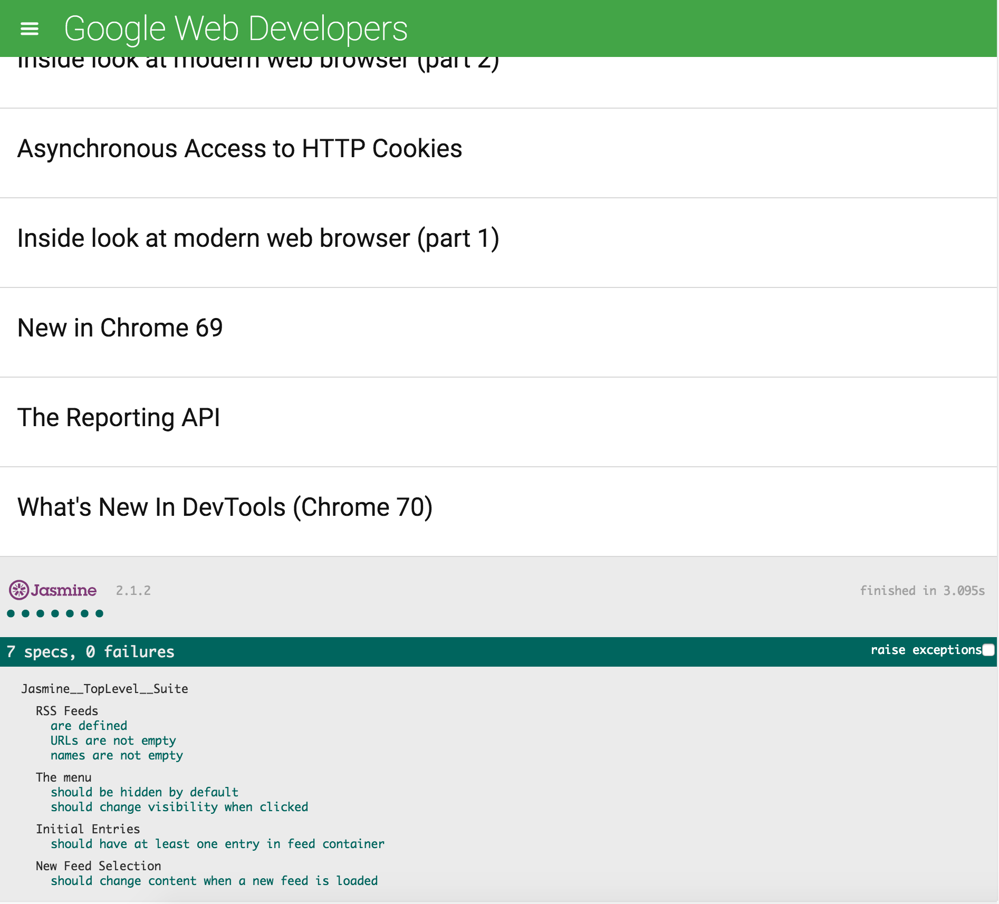

# frontend-nanodegree-feedreader

This is a Udacity Frontend Nanodegree Project on learning Test Driven Development with Jasmine. The goal was to test the functionality of an already created Feed Reader.

## Motivation

Testing is an important part of the development process and many organizations practice a standard of development known as "test-driven development". This is when developers write tests first, before they ever start developing their application. All the tests initially fail and then they start writing application code to make these tests pass.

Whether working in an organization that uses test-driven development or in an organization that uses tests to make sure future feature development doesn't break existing features, it's an important skill to have!

## How to Run?

- fork the repository
- clone the forked version of the respository with git clone `<link of repo>` on your terminal in the directory you want the game in. The link is found in the green clone or download button on github.
- open the `index.html` file in browser of choice

## Screenshots

## Tech/framework used

- Vanilla Javascript
- [Jasmine](https://jasmine.github.io/index.html)
- [Handlebars](http://handlebarsjs.com/)
- [Google FeedReader API](https://developers.google.com/feed/)(Used a Deprecated API, but the major lessons goal was reached. Learning Testing with JavaScript!)
- HTML
- CSS
- [ESLint](https://eslint.org/)
- [SweetAlert](https://sweetalert.js.org/)
- [Prettier](https://prettier.io/)
- Git

## ToDo

- Refactor

## Credits

Thanks to Udacity for their awesome Front end Nanodegree
